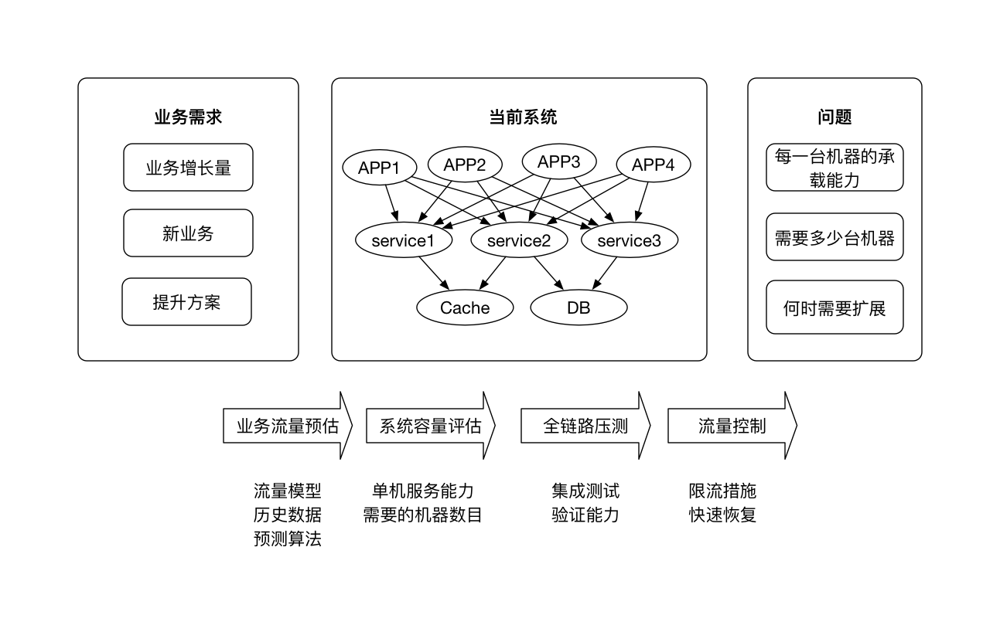

# 系统架构设计文档

| 作者 | 版本 |  日期 | 改动
|----|:----:|:-----|-----
| xx | V1.0 | 2016-02-25 | 初始版本

[本文档根据系统的业务流程对系统进行模块划分、架构设计、难点分析等，是最为核心的一个文档。]

## 一. 前言

[这里主要定义一些系统相关的概念和名词，也可以描述一下系统的需求]

## 二. 总体设计

[这里给出总体架构设计图，描述系统有哪几个模块组成，每个模块间的交互、数据流向等]

模块组成：

1. 模块一：模块一的描述
2. 模块二：模块二的描述

[这里也可以给出系统的软件层面架构设计，即基于那些软件服务，之间的关系如何]

## 三. 模块设计

### 3.1 模块一

[描述模块一的核心流程、详细设计、技术关键点等，可以单独为**xx模块设计文档**]

1. 核心流程

1. 详细设计

	- 高可用设计
	- 高性能设计
	- 可扩展设计
	- 安全性设计
	- 其他设计

1. 技术关键点

### 3.2 模块二

[描述模块二的核心流程、详细设计、技术关键点等]

## 四. 存储设计

[给出总体的存储架构，如：本地缓存+Redis缓存+MySQL。描述使用到数据库、缓存、消息队列、搜索引擎并量化。]

### 4.1 数据库设计

**表名**：wl_user

**数据增长**：[描述数据增长趋势，预估DAU xx时，每日新增n条记录]

**分区策略**：[描述何时需要分区（一般是单表记录超过千万且不限于基于主键的查询），是水平分区还是垂直分区，哪一个属性是策略因子等，如：DAU达到xx时需要进行水平分区，uid为策略因子，hash(uid) % n为分区算法。]

| 属性 | 数据类型 |  是否主键| 自增 | 描述 | 备注
|----|:----:|:----- |:---- |:---- | :----
| id | bigint(20) | 是 | mysql自增/redis发号器 | 用户ID
| name | varchar | 否 | 否|名称
| city | varchar | 否 | 否| 所在城市

### 4.2 缓存量化分析

| key | 数据结构 |  数量 | 大小 | 有效期 | 读写峰值QPS | 备注
|----|:----:|:----- |:---- |:---- | :---- | :----
| user.count | long | 用户数 |  用户数 x 8 kb | 长久 | 写：200qps 读：30000qps | 记录用户的总数
| user.queue| List | 1 | 500 x 100 kb | 半年 | 写：10000qps 读：100qps | 每一个元素为json字符串大约为100byte，平均保持队列长度为500，消费者为quartz线程每隔1秒消费100个元素| 
	
综上，Redis需要预留xx内存，后续内存使用保持不变/持续增加（如果持续增加，需要给出增加趋势）。

## 五. 第三方服务依赖

[列出并描述依赖的第三方服务，如RPC接口、RESTful API、第三方输出的数据等]

## 六. 部署方案

[硬件要求、服务器部署方式、组网方式等，如：四台服务器，16G内存、128G机械硬盘，每台部署两个Tomcat，堆大小5G。CPU密集型应用。]

## 七. 系统容量规划
 
[预估关键模块的系统容量，供运维部署服务节点。包括预估业务最大流量（峰值QPS/连接数/数据生产速率）、预估单机承载/消费能力、需要的机器数目以及超流量后的流量控制措施。容量规划实施流程见下图:

]

## 八. 技术难点

[这里描述系统总体上存在的技术难点以及解决的方案]

## 九. 存在的问题以及未来规划

[这里主要列出目前未解决的问题。如果本次设计需要后续的优化迭代，这里还需要给出演进规划安排]
 
## 十. 风险控制

[描述此技术使用可能面临的风险以及应对策略，如：

| 风险因素 | 解决方案
|----|:----
| xx请假，其负责模块可能延期 | 抽调xx支援，保证进度
| xx技术难点暂时未有好的解决方案 | 先上简单的方案，尽快集中资源突破难点
]